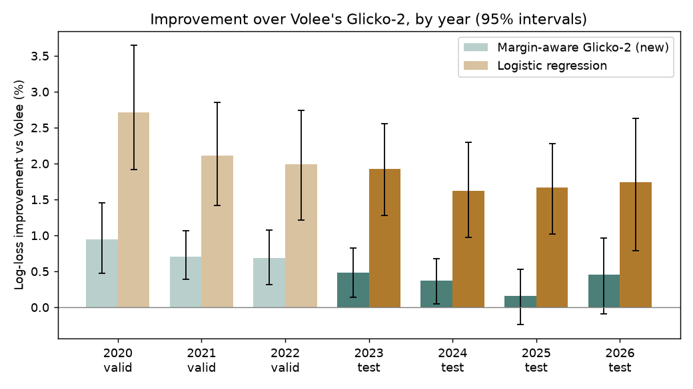
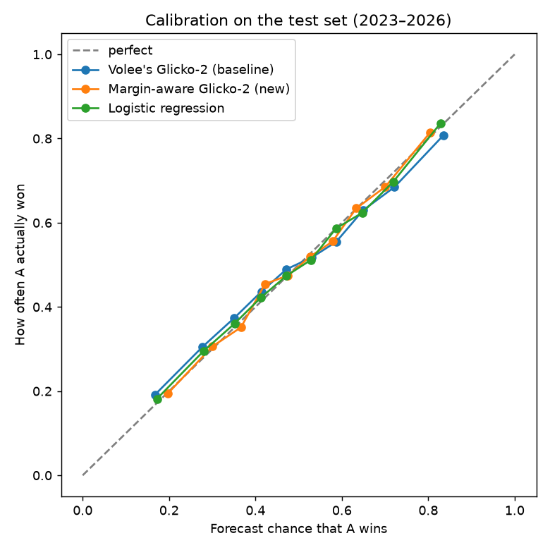
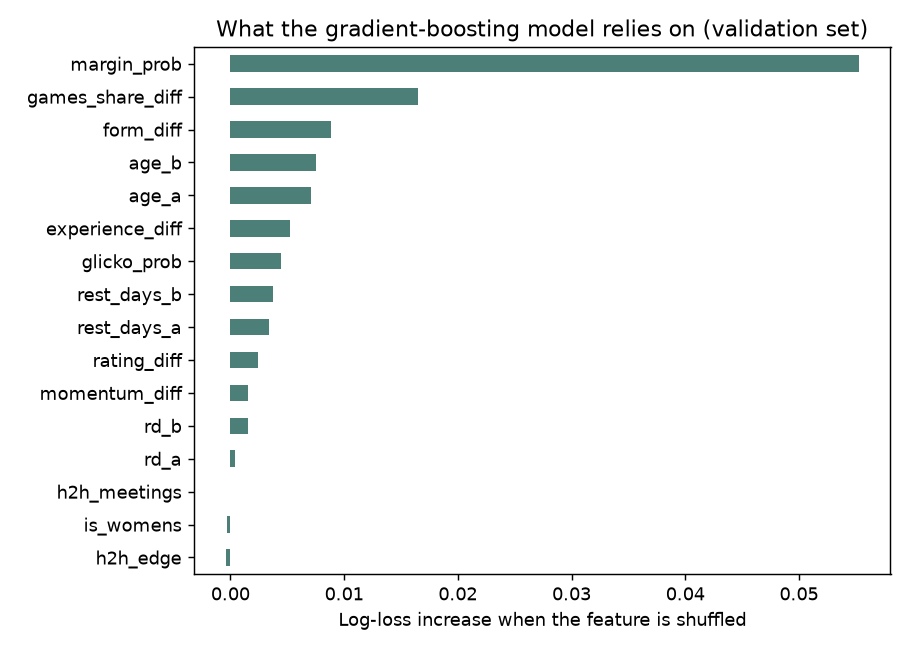

# Results

Generated by `python -m volee_ml.evaluate`. Log loss is the main metric (lower is better).

## Test set — 2023–2026, looked at once

| Model | Log loss | Brier | Accuracy | AUC | Log loss vs Volee |
|---|---|---|---|---|---|
| Volee's Glicko-2 (baseline) | 0.6279 | 0.2194 | 64.0% | 0.7005 | +0.0% |
| Glicko-2, textbook start values | 0.6333 | 0.2210 | 64.2% | 0.7000 | -0.8% |
| Glicko-2, tuned on validation | 0.6279 | 0.2194 | 64.0% | 0.7005 | +0.0% |
| Margin-aware Glicko-2 (new) | 0.6257 | 0.2184 | 64.3% | 0.7027 | +0.4% |
| Logistic regression | 0.6170 | 0.2147 | 65.2% | 0.7144 | +1.7% |
| Gradient boosting | 0.6207 | 0.2162 | 64.9% | 0.7106 | +1.2% |

## Is it real? 95% confidence intervals on the test set

Log-loss improvement, with a tournament-level cluster bootstrap (2,000 re-draws).
An interval entirely above zero means the gain is not luck.

| Model | Log-loss improvement vs Volee's Glicko-2 | 95% interval |
|---|---|---|
| Margin-aware Glicko-2 (new) | +0.35% | +0.16% to +0.54% |
| Logistic regression | +1.74% | +1.41% to +2.09% |
| Gradient boosting | +1.15% | +0.74% to +1.61% |

## Validation set — 2020–2022, used to compare models

| Model | Log loss | Brier | Accuracy | AUC | Log loss vs Volee |
|---|---|---|---|---|---|
| Volee's Glicko-2 (baseline) | 0.6302 | 0.2205 | 63.8% | 0.6965 | +0.0% |
| Glicko-2, textbook start values | 0.6344 | 0.2220 | 63.6% | 0.6951 | -0.7% |
| Glicko-2, tuned on validation | 0.6302 | 0.2205 | 63.8% | 0.6965 | +0.0% |
| Margin-aware Glicko-2 (new) | 0.6256 | 0.2184 | 64.4% | 0.7023 | +0.7% |
| Logistic regression | 0.6165 | 0.2145 | 65.1% | 0.7150 | +2.2% |
| Gradient boosting | 0.6194 | 0.2156 | 65.2% | 0.7124 | +1.7% |

## One slice of the test set

**Matches where at least one player's rating is still uncertain (RD over 90)** (2,629 matches)

| Model | Log loss | Brier | Accuracy | AUC | Log loss vs Volee |
|---|---|---|---|---|---|
| Volee's Glicko-2 (baseline) | 0.6145 | 0.2126 | 66.1% | 0.7237 | +0.0% |
| Glicko-2, textbook start values | 0.6377 | 0.2186 | 66.9% | 0.7204 | -3.8% |
| Glicko-2, tuned on validation | 0.6145 | 0.2126 | 66.2% | 0.7237 | +0.0% |
| Margin-aware Glicko-2 (new) | 0.6080 | 0.2097 | 68.1% | 0.7318 | +1.0% |
| Logistic regression | 0.5954 | 0.2044 | 68.3% | 0.7476 | +3.1% |
| Gradient boosting | 0.5966 | 0.2041 | 69.1% | 0.7484 | +2.9% |

## What the models learned

Gradient boosting, permutation importance on validation (log-loss increase when shuffled):

| Feature | Importance |
|---|---|
| margin_prob | 0.0553 |
| games_share_diff | 0.0165 |
| form_diff | 0.0088 |
| age_b | 0.0075 |
| age_a | 0.0071 |
| experience_diff | 0.0053 |
| glicko_prob | 0.0044 |
| rest_days_b | 0.0037 |
| rest_days_a | 0.0034 |
| rating_diff | 0.0024 |
| momentum_diff | 0.0016 |
| rd_b | 0.0015 |
| rd_a | 0.0004 |
| h2h_meetings | -0.0000 |
| is_womens | -0.0003 |
| h2h_edge | -0.0004 |

Logistic regression weights (features scaled to the same spread; positive helps A win):

| Feature | Weight |
|---|---|
| games_share_diff | +0.312 |
| glicko_prob | +0.292 |
| margin_prob | +0.284 |
| rating_diff | +0.276 |
| form_diff | -0.275 |
| experience_diff | +0.262 |
| age_a | -0.196 |
| age_b | +0.191 |
| rest_days_a | -0.131 |
| rest_days_b | +0.123 |
| rd_a | +0.062 |
| momentum_diff | +0.056 |
| rd_b | -0.054 |
| h2h_edge | +0.052 |
| h2h_meetings | -0.006 |
| is_womens | -0.005 |

